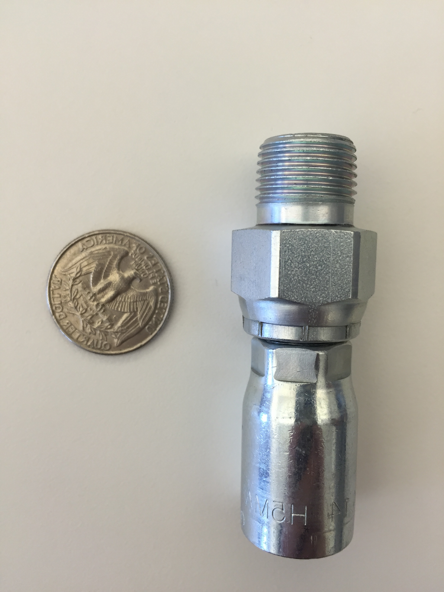

Machine Part Image Identifier
=============================

About
-----

**partID** is a miniature library to process images containing a quarter
and a machine part. Once the part is located, various dimensions may be
calculated. For now only the *height*, *width*, and *thread pitch* are
measured.

Example
-------

+----------+----------+
|  Input   |  Output  |
+==========+==========+
| |input|  | |output| |
+----------+----------+

.. |output| image:: figures/output.jpg
  :scale: 15 %

Process
-------

* Apply Gaussian thresholding
* Identify all contours in image
* Combine overlapping contours
* Select largest contour and largest *square-like* contour
* Realign image based on largest contour angle
* Draw dimensions and output calculations

+-----------+-----------+
| |gauss|   | |conts|   |
+-----------+-----------+
| |overlap| | |largest| |
+-----------+-----------+
| |align|   | |draw|    |
+-----------+-----------+

.. |gauss| image::   https://maneyko.com/partID/output/00_0.jpg
.. |conts| image::   https://maneyko.com/partID/output/00_1.jpg
.. |overlap| image:: https://maneyko.com/partID/output/00_2.jpg
.. |largest| image:: https://maneyko.com/partID/output/00_3.jpg
.. |align| image::   https://maneyko.com/partID/output/00_4.jpg
.. |draw| image::    https://maneyko.com/partID/output/00_5.jpg

To run
------
.. code:: bash

  # Standalone script
  ./main.py https://maneyko.com/partID/input.jpg

  # Or as a module
  python3 -m partID https://maneyko.com/partID/input.jpg
