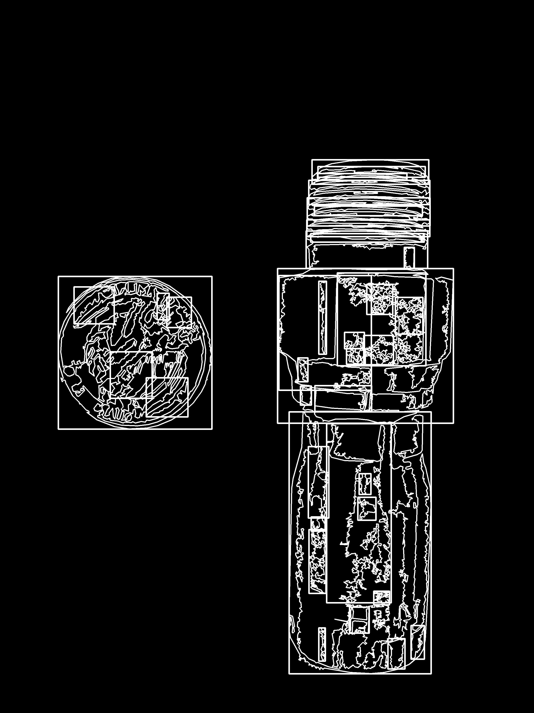
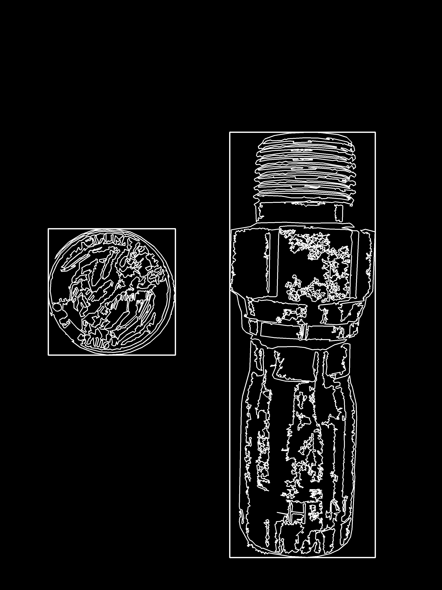
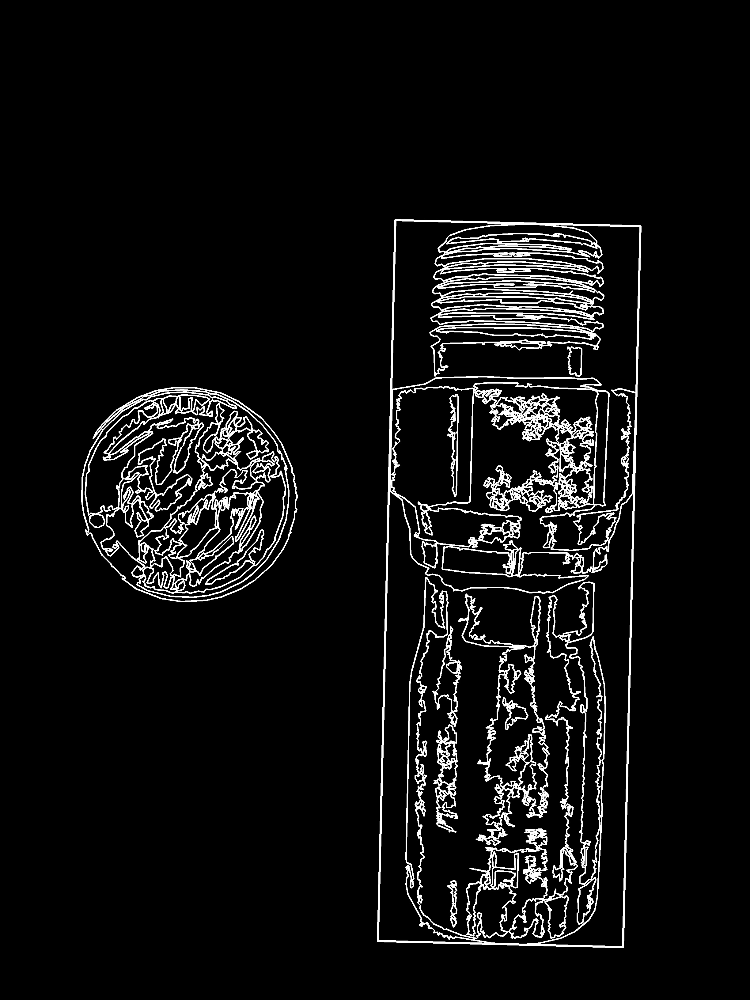
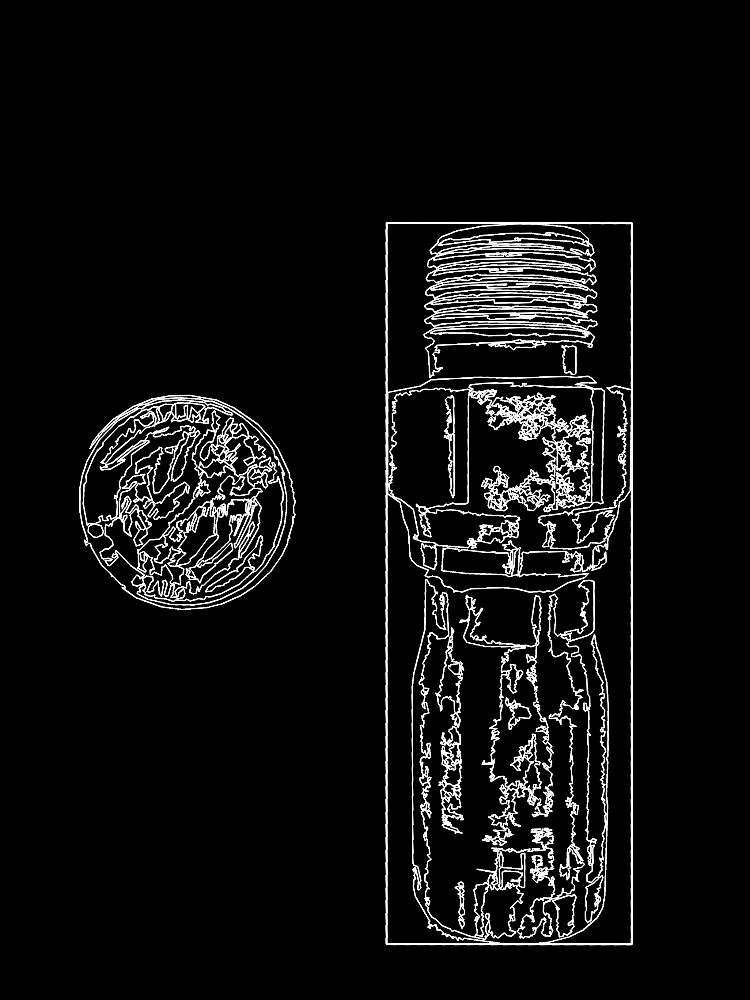

Machine Part Identifier
=======================

About
-----

**partID** is a miniature library to get the *real dimensions* of an
object from an image with a quarter. Various functions using OpenCV_
are used for the extraction of the part and quarter from the image, then
custom algorithms may be implemented to get certain features from the
part. In this case an algorithm to calculate thread pitch was developed.
For now the *height*, *width*, and *thread pitch* are measured to a mean
accuracy of 90% tested on over 40 different images.

.. _OpenCV: http://opencv.org/

Example
-------

+----------+----------+
|  Input   |  Output  |
+==========+==========+
| |input|  | |output| |
+----------+----------+

.. |input| image:: figures/input.jpg
  :scale: 15 %
.. |output| image:: figures/output.jpg
  :scale: 15 %

Process
-------

* Apply Gaussian thresholding
* Identify all contours in image
* Combine overlapping contours
* Select largest contour and largest *square-like* contour
* Realign image based on largest contour angle
* Draw dimensions and output calculations

+-----------+-----------+
| |step0|   | |step1|   |
+-----------+-----------+
| |step2|   | |step3|   |
+-----------+-----------+

To run
------
.. code:: bash

  # Standalone script
  ./main.py figures/00.jpg

  # Or as a module
  python3 -m partID figures/00.jpg
