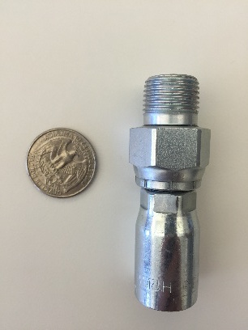
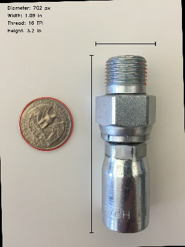

Machine Part Image Identifier
=============================
*develop branch*

About
-----

This is a miniature library to process images containing a quarter and a
machine part. Once the part is located, various dimensions may be calculated.
For now only the height, width, and thread pitch are measured.

Example
-------

+----------+----------+
|  Input   |  Output  |
+==========+==========+
| |input|  | |output| |
+----------+----------+

Installation
------------
.. code:: bash

  git clone https://github.com/maneyko/partID.git
  mkdir images
  mv img/path/{image_name}.{jpg,png} images/

To run
------
.. code:: bash

  python2 partID/main.py ./images/{image_name}.{jpg,png}

Output
------

Output images will be in ``./output/``
